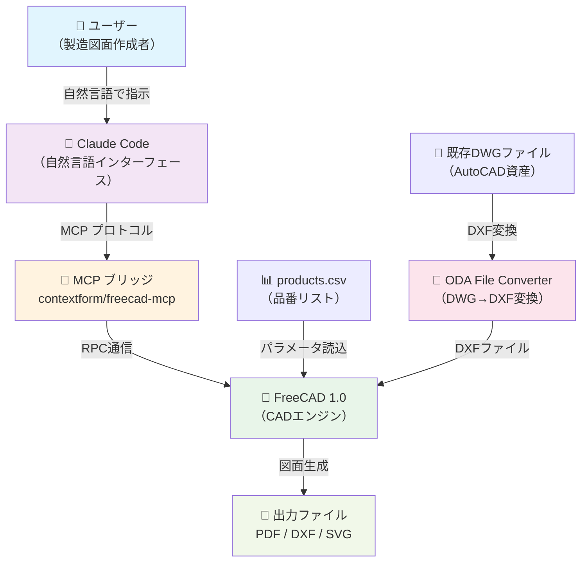
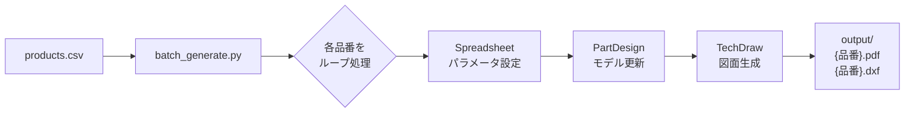
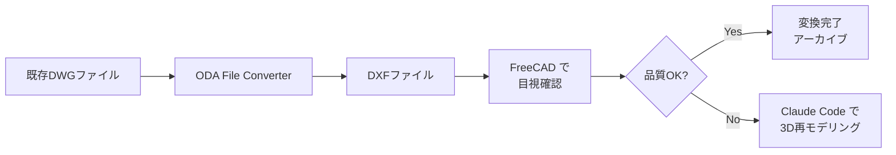

# システム全体像

> draftml — AutoCAD → FreeCAD + Claude Code MCP 移行プロジェクト

**最終更新**: 2026-03-23
**関連ADR**: [ADR-0001](02-adr/ADR-0001-cad-selection.md) / [ADR-0002](02-adr/ADR-0002-mcp-bridge-selection.md)

---

## 1. コンテキスト図



---

## 2. コンポーネント構成

### 2.1 CADエンジン: FreeCAD 1.0

FreeCAD は本プロジェクトの中核コンポーネント。以下の3つのワークベンチを使用する。

| ワークベンチ    | 役割           | 使用場面                                               |
| --------------- | -------------- | ------------------------------------------------------ |
| **PartDesign**  | 3Dモデリング   | 建材の3D形状を作成（押し出し・ポケット・フィレット等） |
| **Spreadsheet** | パラメータ管理 | 寸法値を変数として管理し、モデルとバインド             |
| **TechDraw**    | 2D図面生成     | 3Dモデルから正面図・側面図・断面図を投影し、寸法を記入 |

### 2.2 MCPブリッジ

Claude Code と FreeCAD を接続する中間レイヤー。

| 種別           | パッケージ                | 接続方式                             | 用途                                                                                                    |
| -------------- | ------------------------- | ------------------------------------ | ------------------------------------------------------------------------------------------------------- |
| 推奨版         | `contextform/freecad-mcp` | npm + AICopilot ワークベンチ経由 RPC | Claude Code からの標準操作                                                                              |
| バックアップ版 | `neka-nat/freecad-mcp`    | uvx + Claude Desktop 設定            | 推奨版が動作しない場合のフォールバック。`--only-text-feedback` オプションでトークン節約可（調査で判明） |

### 2.3 変換ツール: ODA File Converter

既存の AutoCAD DWG ファイルを DXF に変換するためのツール。

- 入力: DWG（AutoCAD ネイティブ形式）
- 出力: DXF（CAD間データ交換形式）
- GUI / CLI の両方で操作可能

### 2.4 自動化スクリプト（Phase 1 で構築予定）

FreeCAD 内蔵 Python による自動化スクリプト群。

| スクリプト            | 役割                                   |
| --------------------- | -------------------------------------- |
| `generate_drawing.py` | 単一品番の図面を生成                   |
| `batch_generate.py`   | CSV を読み込み複数品番の図面を一括生成 |
| `convert_dwg.py`      | DWG → DXF の一括変換をバッチ実行       |

---

## 3. データフロー

### 3.1 新規図面作成フロー


### 3.2 CSV一括生成フロー



### 3.3 DWG変換フロー



---

## 4. ディレクトリ構成

```
draftml/
├── docs/                    # ドキュメント（コミット対象）
│   ├── 00-requirements.md   #   要件定義書
│   ├── 01-system-context.md #   本書
│   ├── 02-adr/              #   ADR（技術選定記録）
│   ├── 03-detailed-design.md#   詳細設計書
│   ├── 04-operations.md     #   運用・保守手順書
│   └── 05-release-plan.md   #   リリース計画
│
├── scripts/                 # 自動化スクリプト（コミット対象）
│   ├── generate_drawing.py  #   単品番図面生成
│   ├── batch_generate.py    #   CSV一括生成
│   └── convert_dwg.py       #   DWG→DXF一括変換
│
├── templates/               # 図枠テンプレート（コミット対象）
│   └── frame_a3_landscape.svg#  A3横 社内標準図枠
│
├── products.csv             # 品番リスト サンプル（コミット対象）
├── .mcp.json                # MCP設定（コミット対象）
├── CLAUDE.md                # Claude Code 指示書
├── README.md                # プロジェクト説明
├── .gitignore               # コミット除外設定
│
├── .reference/              # 内部資料（コミット対象外）
│   └── handover.md          #   引き継ぎ指示書 原本
│
├── tasks/                   # 進捗管理（コミット対象外）
│
└── output/                  # 生成図面（コミット対象外）
    ├── {品番}.pdf
    └── {品番}.dxf
```

---

## 5. 外部依存

| コンポーネント     | 最低バージョン     | インストール方法           | 備考                                                    |
| ------------------ | ------------------ | -------------------------- | ------------------------------------------------------- |
| FreeCAD            | 1.0                | 公式インストーラー         | PartDesign + TechDraw + Spreadsheet を使用              |
| Node.js            | 18                 | 公式インストーラー / nvm   | contextform/freecad-mcp の前提条件                      |
| npm                | Node.js に付属     | —                          | `freecad-mcp-setup` のインストールに使用                |
| Python             | 3.x（FreeCAD内蔵） | FreeCAD に同梱             | 自動化スクリプトの実行環境                              |
| uv                 | 最新版             | `pip install uv`           | neka-nat/freecad-mcp の起動に使用（バックアップ時のみ） |
| ODA File Converter | 最新版             | 公式サイト（要メール登録） | DWG → DXF 変換                                          |

---

_本書は ADR-0001, ADR-0002 の決定事項に基づき、システムの全体構造を定義したものです。_
