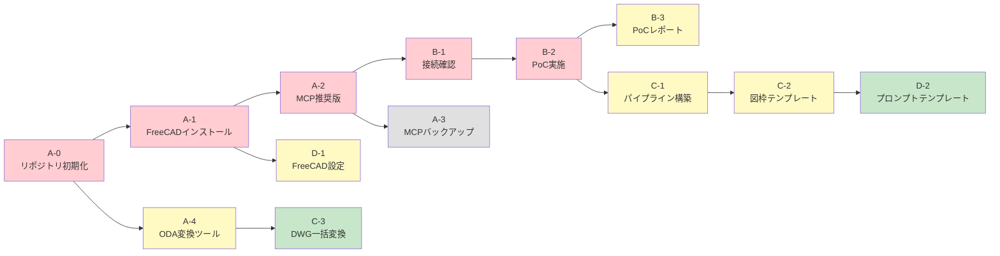
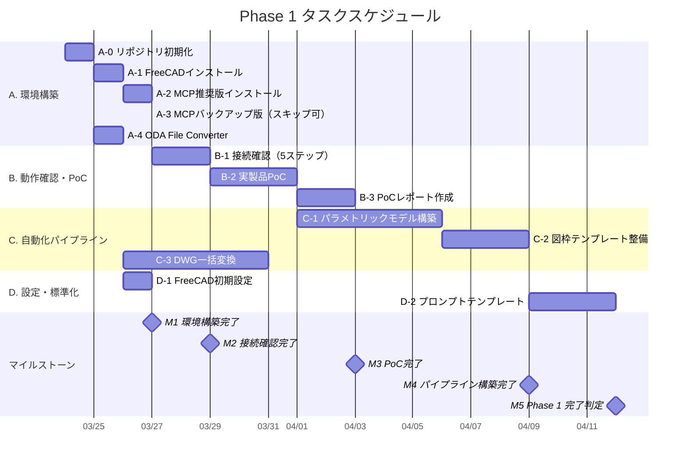

# リリース計画

> draftml — AutoCAD → FreeCAD + Claude Code MCP 移行プロジェクト

**最終更新**: 2026-03-24
**起点日**: 2026-03-24（Phase 1 開始予定）

---

## 1. Phase 全体像（リリース計画）

| Phase       | 期間       | 目標          | 主な成果物                               | 完了基準                                        |
| ----------- | ---------- | ------------- | ---------------------------------------- | ----------------------------------------------- |
| **Phase 0** | 完了済み   | 調査・分析    | 調査レポート、handover.md                | レポート作成・意思決定完了                      |
| **Phase 1** | Week 1〜4  | 環境構築・PoC | FreeCAD環境、PoC図面、自動化パイプライン | [7項目の完了基準](#phase-1-completion-criteria) |
| **Phase 2** | Month 2〜6 | 本番移行      | 全品番の図面移行、AutoCADライセンス停止  | 全品番がFreeCADで作成可能                       |
| **Phase 3** | Month 6+   | 運用安定化    | 最適化されたパイプライン、運用手順書     | 自動化率80%達成                                 |

### Phase 1 完了基準 {#phase-1-completion-criteria}

Phase 2 へ進むために、以下の7項目すべてを満たすこと（`00-requirements.md` §6 と同一）:

- [ ] FreeCAD 1.0 が正常起動すること
- [ ] Claude Code から MCP経由で3Dオブジェクトを作成できること
- [ ] TechDraw で3面図が自動生成でき、PDF出力できること
- [ ] 実製品1品番の製造図面を FreeCAD + Claude Code で生成できること
- [ ] CSV → 一括図面生成パイプラインが動作すること（最低5品番）
- [ ] 既存DWGの主要ファイルがDXF変換されFreeCADで開けること
- [ ] PoCレポートが作成・共有されていること

---

## 2. Phase 1 マイルストーン

| マイルストーン               | 予定         | 関連タスク         | 通過判定                                                             | 状態 |
| ---------------------------- | ------------ | ------------------ | -------------------------------------------------------------------- | ---- |
| **M1: 環境構築完了**         | Week 1 Day 2 | A-0, A-1, A-2, D-1 | FreeCAD + MCP がインストールされ、RPC接続が確立していること          | [ ]  |
| **M2: 接続確認完了**         | Week 1 Day 3 | B-1                | Claude Code から FreeCAD に5ステップの操作が成功すること             | [x]  |
| **M3: PoC完了**              | Week 2       | A-3, A-4, B-2, B-3 | 実製品1品番の図面が生成され、PoCレポートが作成されていること         | [x]  |
| **M4: パイプライン構築完了** | Week 3       | C-1, C-2, C-3      | CSV一括生成が5品番以上で動作し、図枠テンプレートが整備されていること | [x]  |
| **M5: Phase 1 完了判定**     | Week 4       | D-2, 全体検証      | 7項目の完了基準すべてを満たすこと                                    | [x]  |

---

## 3. タスク依存関係とスケジュール（ガントチャート）

### 3.1 依存関係図

凡例: 🔴赤 = 即時着手 / 🟡黄 = Week 1 中 / 🟢緑 = Week 2 以降

### 3.2 ガントチャート

---

## 4. 進捗トラッキング（バーンダウン）

### Phase 1 タスク消化状況

| #   | タスク                                                 | 優先度 | 予定       | 状態 |
| --- | ------------------------------------------------------ | ------ | ---------- | ---- |
| A-0 | リポジトリ初期化                                       | 🔴     | Day 1      | [x]  |
| A-1 | FreeCAD 1.0 インストール                               | 🔴     | Day 1      | [x]  |
| A-2 | contextform/freecad-mcp インストール                   | 🔴     | Day 1      | [x]  |
| D-1 | FreeCAD 初期設定最適化                                 | 🟡     | Day 1      | [x]  |
| A-3 | neka-nat/freecad-mcp インストール（B-1成功により不要） | ⚪     | スキップ可 | —    |
| A-4 | ODA File Converter インストール                        | 🟡     | Day 2      | [x]  |
| B-1 | Claude Code × FreeCAD 接続確認（Step 1-2 完了）        | 🔴     | Day 2-3    | [x]  |
| B-2 | 実製品 PoC 実施                                        | 🔴     | Day 3-5    | [x]  |
| B-3 | PoC 結果レポート作成                                   | 🟡     | Day 5-7    | [x]  |
| C-1 | Spreadsheet 駆動パイプライン構築                       | 🟡     | Week 2     | [x]  |
| C-2 | 社内図枠テンプレート整備                               | 🟡     | Week 2     | [x]  |
| C-3 | 既存DWGファイル一括変換                                | 🟢     | Week 2-3   | [x]  |
| D-2 | プロンプトテンプレート整備                             | 🟢     | Week 3-4   | [x]  |

**残りタスク数**: 1 / 11

> 進め方: 各タスク完了時に `[ ]` を `[x]` に更新し、残りタスク数を減算する。
> Week 1 終了時点で残り 7 以下、Week 2 終了時点で残り 3 以下が目安。

---

## 5. リスクと対策

| #   | リスク                                                | 発生確率 | 影響度 | 対策                                                        | 検知タイミング   |
| --- | ----------------------------------------------------- | -------- | ------ | ----------------------------------------------------------- | ---------------- |
| R1  | FreeCAD TechDraw の図面品質が製造現場基準を満たさない | 中       | **高** | B-2 PoC で早期検証。不足の場合は手動調整ワークフローを確立  | M3（PoC完了）    |
| R2  | contextform/freecad-mcp の接続が不安定                | 中       | 中     | neka-nat 版にフォールバック（A-3 で事前準備）               | M2（接続確認）   |
| R3  | DWG → DXF 変換時にジオメトリが崩れる                  | 中       | 中     | 目視確認 + Claude Code による3D再モデリング                 | C-3 実行時       |
| R4  | CSV 一括生成でエラーが発生する品番がある              | 高       | 低     | エラー品番をスキップして継続する設計 + エラーログ出力       | C-1 実行時       |
| R5  | FreeCAD / MCP のバージョンアップによる互換性問題      | 低       | 中     | バージョン固定運用。更新前に検証環境で確認                  | Phase 2 以降     |
| R6  | `execute_python` の cp932 文字化け                    | 高       | 低     | 日本語を含めない運用ルール（確立済み）                      | B-1 実行時       |
| R7  | `view_control(screenshot)` によるセッション破壊       | —        | —      | **顕在化済み・対策済み**: テキスト確認 + ファイル保存に変更 | Session 3 で発見 |

---

## 6. Phase 2 詳細計画

> M6 Discovery（2026-03-24）の成果と ADR-0003（ハイブリッド方式）に基づく。

### 6.1 方針

- **図面生成方式**: ハイブリッド（ADR-0003）
  - 設計フェーズ: FreeCAD で第三角法準拠マスターテンプレート作成
  - 量産フェーズ: ezdxf でパラメトリック寸法書換え・バッチ出力
- **対象製品**: MDF製ドア枠（IS-S-KMD-CS-R シリーズ、100品番以上）
- **3Dモデル不要**: 2D製造図面に集中
- **入力**: Excel/CSV（frame_height + opening_height の2パラメータで96%カバー）
- **出力**: DXF + PDF（12シート/品番）

### 6.2 マイルストーン

| マイルストーン               | 内容                                  | 通過判定                                             | 状態 |
| ---------------------------- | ------------------------------------- | ---------------------------------------------------- | ---- |
| **M6: Discovery**            | 製品分析・技術選定・ロードマップ策定  | ADR-0003 accepted、product-analysis.md 作成          | [x]  |
| **M7: マスターテンプレート** | 第三角法準拠テンプレート12シート作成  | パーツ1B（最シンプル）1シートでプロトタイプ検証      | [ ]  |
| **M8: ezdxf パイプライン**   | パラメトリック寸法書換え + バッチ生成 | 2品番（900mm/1300mm）× 12シート = 24枚の自動生成成功 | [ ]  |
| **M9: 製品ライン展開**       | 全品番への展開 + BOM自動生成          | 使用頻度上位80%の品番が生成可能                      | [ ]  |
| **M10: AutoCAD停止判定**     | 品質検証 + ライセンス停止決定         | 停止判定基準（§6.7）すべて合格                       | [ ]  |

### 6.3 タスク一覧

#### M6: Discovery（完了）

| #    | タスク                   | 成果物                                                | 状態 |
| ---- | ------------------------ | ----------------------------------------------------- | ---- |
| M6-1 | 寸法差分分析             | `.reference/dim_comparison_result.txt`                | [x]  |
| M6-2 | パーツ構成・加工工程分析 | `.reference/parts_analysis_result.txt`                | [x]  |
| M6-3 | 製品分析ドキュメント作成 | `docs/product-analysis.md`                            | [x]  |
| M6-4 | 図面生成方式ADR          | `docs/02-adr/ADR-0003-drawing-generation-approach.md` | [x]  |
| M6-5 | Phase 2 ロードマップ更新 | `docs/05-release-plan.md` §6                          | [x]  |
| M6-6 | コミット                 | Phase 1 + M6 成果物一括                               | [ ]  |

#### M7: マスターテンプレート

| #    | タスク                     | 内容                                               | 依存             | 状態 |
| ---- | -------------------------- | -------------------------------------------------- | ---------------- | ---- |
| M7-1 | プロトタイプ（パーツ1B）   | 最もシンプルな枠材1シート分を第三角法準拠で生成    | M6               | [ ]  |
| M7-2 | 既存DXFプロファイル抽出    | ezdxf で断面プロファイル・寸法エンティティを抽出   | M6               | [ ]  |
| M7-3 | 第三角法レイアウト設計     | 12シートのビュー配置・スケール・寸法配置ルール策定 | M7-1             | [ ]  |
| M7-4 | 図枠テンプレート（DXF版）  | A3横、第三角法シンボル、社内表題欄                 | M7-1             | [ ]  |
| M7-5 | マスターテンプレート作成   | 12シート分のDXFテンプレート完成                    | M7-2, M7-3, M7-4 | [ ]  |
| M7-6 | パラメトリックマーカー設計 | ezdxfで検索・置換可能な寸法マーカー命名規約        | M7-5             | [ ]  |

#### M8: ezdxf パイプライン

| #    | タスク                 | 内容                                         | 依存             | 状態 |
| ---- | ---------------------- | -------------------------------------------- | ---------------- | ---- |
| M8-1 | ezdxf 導入             | pip install + 基本動作検証                   | M7-6             | [ ]  |
| M8-2 | パラメトリックエンジン | マーカー検索 → 寸法書換え → 品番テキスト更新 | M8-1             | [ ]  |
| M8-3 | 品質チェック           | 寸法整合性・エンティティ数・BoundBox検証     | M8-2             | [ ]  |
| M8-4 | PDF出力                | ODA File Converter による DXF → PDF 変換     | M8-2             | [ ]  |
| M8-5 | CSV一括生成            | Excel/CSV → 12シート × N品番のバッチ処理     | M8-2, M8-3, M8-4 | [ ]  |
| M8-6 | 検証（900mm + 1300mm） | 既存図面との目視比較 + 寸法値照合            | M8-5             | [ ]  |

#### M9: 製品ライン展開

| #    | タスク               | 内容                                          | 依存       | 状態 |
| ---- | -------------------- | --------------------------------------------- | ---------- | ---- |
| M9-1 | 製品データモデル設計 | パーツ構成・パラメータ関係・BOM構造の中間表現 | M8-6       | [ ]  |
| M9-2 | BOM自動生成          | 部材リスト + 金物リストのCSV/JSON出力         | M9-1       | [ ]  |
| M9-3 | 追加品番テンプレート | 窓枠・その他品種のテンプレート追加            | M9-1       | [ ]  |
| M9-4 | 上位80%品番の生成    | 使用頻度上位品番の一括生成・検証              | M9-2, M9-3 | [ ]  |
| M9-5 | 製造現場検証         | 生成図面のサンプル配布 + フィードバック収集   | M9-4       | [ ]  |

#### M10: AutoCAD停止判定

| #     | タスク               | 内容                                  | 依存  | 状態 |
| ----- | -------------------- | ------------------------------------- | ----- | ---- |
| M10-1 | 品質レビュー         | 製造現場フィードバック集約 + 品質是正 | M9-5  | [ ]  |
| M10-2 | 停止判定会議         | 判定基準（§6.7）に基づく合否判定      | M10-1 | [ ]  |
| M10-3 | ライセンス停止手続き | AutoCAD契約の更新停止                 | M10-2 | [ ]  |

### 6.4 依存関係図

```mermaid
graph LR
    M6["M6<br/>Discovery"] --> M71["M7-1<br/>プロトタイプ"]
    M6 --> M72["M7-2<br/>プロファイル抽出"]
    M71 --> M73["M7-3<br/>レイアウト設計"]
    M71 --> M74["M7-4<br/>図枠テンプレート"]
    M72 --> M75["M7-5<br/>マスターテンプレート"]
    M73 --> M75
    M74 --> M75
    M75 --> M76["M7-6<br/>マーカー設計"]

    M76 --> M81["M8-1<br/>ezdxf導入"]
    M81 --> M82["M8-2<br/>パラメトリックエンジン"]
    M82 --> M83["M8-3<br/>品質チェック"]
    M82 --> M84["M8-4<br/>PDF出力"]
    M82 --> M85["M8-5<br/>CSV一括生成"]
    M83 --> M85
    M84 --> M85
    M85 --> M86["M8-6<br/>検証"]

    M86 --> M91["M9-1<br/>データモデル"]
    M91 --> M92["M9-2<br/>BOM生成"]
    M91 --> M93["M9-3<br/>追加品番"]
    M92 --> M94["M9-4<br/>80%品番"]
    M93 --> M94
    M94 --> M95["M9-5<br/>現場検証"]

    M95 --> M101["M10-1<br/>品質レビュー"]
    M101 --> M102["M10-2<br/>停止判定"]
    M102 --> M103["M10-3<br/>ライセンス停止"]

    style M6 fill:#c8e6c9
    style M71 fill:#fff9c4
    style M72 fill:#fff9c4
    style M73 fill:#fff9c4
    style M74 fill:#fff9c4
    style M75 fill:#fff9c4
    style M76 fill:#fff9c4
    style M81 fill:#bbdefb
    style M82 fill:#bbdefb
    style M83 fill:#bbdefb
    style M84 fill:#bbdefb
    style M85 fill:#bbdefb
    style M86 fill:#bbdefb
    style M91 fill:#e1bee7
    style M92 fill:#e1bee7
    style M93 fill:#e1bee7
    style M94 fill:#e1bee7
    style M95 fill:#e1bee7
    style M101 fill:#ffccbc
    style M102 fill:#ffccbc
    style M103 fill:#ffccbc
```

凡例: 🟢緑 = 完了 / 🟡黄 = M7 テンプレート / 🔵青 = M8 パイプライン / 🟣紫 = M9 展開 / 🟠橙 = M10 判定

### 6.5 品質・自動化強化タスク（調査結果反映）

> FreeCAD x AI/LLM/MCP の OSS・事例調査（2026-03-23 実施）の結果を反映。

| タスク | 内容                                                 | 参考プロジェクト           | フェーズ  |
| ------ | ---------------------------------------------------- | -------------------------- | --------- |
| E-1    | TechDraw 自動化ナレッジ公開（技術記事）              | —（世界初の MCP 経由事例） | Phase 2-3 |
| E-2    | 品質検証パイプライン（形状解析・二重バリデーション） | theosib, fcgen-mcp         | M8 に統合 |
| E-3    | RAG 構築（建材仕様 → スクリプト精度向上）            | openAI-to-freeCAD-workflow | Phase 3   |
| E-4    | ビジョンベース図面検証（VLM 比較）                   | CADomatic v2.0             | Phase 3   |

### 6.6 移行順序

1. **ドア枠（IS-S-KMD-CS-R シリーズ）** → M7-M8 で対応。分析済みで即着手可
2. **使用頻度が高い他品番** → M9 で展開。テンプレート追加が必要
3. **今後修正予定の品番** → 修正タイミングで新パイプラインに移行
4. **アーカイブ目的の品番** → DWG のまま保管（AutoCAD 不要）

### 6.7 AutoCAD ライセンス停止判定基準

以下のすべてを満たすこと:

| #   | 判定基準                               | 検証方法               |
| --- | -------------------------------------- | ---------------------- |
| S-1 | Phase 1 完了基準7項目すべて合格        | §1 のチェックリスト    |
| S-2 | 使用頻度上位80%の品番が自動生成可能    | M9-4 の生成実績        |
| S-3 | 生成図面が第三角法（JIS B 0001）準拠   | 目視検図 + 寸法値照合  |
| S-4 | 製造現場から品質に関する重大問題がない | M9-5 フィードバック    |
| S-5 | BOM出力が既存システムと整合            | MC（資材管理）との突合 |

---

_本書は Phase 1-2 の作業を通じて継続的に更新されます。タスク完了時にチェックを入れ、残りタスク数を更新してください。_
