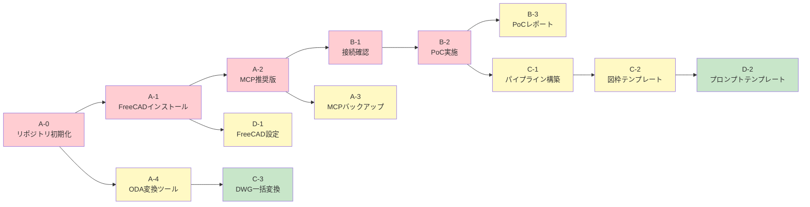
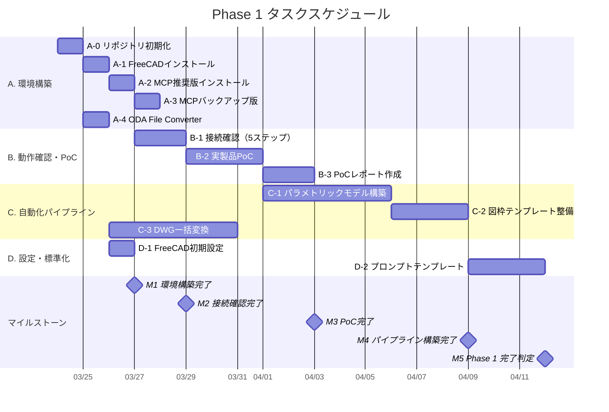

# リリース計画

> draftml — AutoCAD → FreeCAD + Claude Code MCP 移行プロジェクト

**最終更新**: 2026-03-23
**起点日**: 2026-03-24（Phase 1 開始予定）

---

## 1. Phase 全体像（リリース計画）

| Phase       | 期間       | 目標          | 主な成果物                               | 完了基準                                        |
| ----------- | ---------- | ------------- | ---------------------------------------- | ----------------------------------------------- |
| **Phase 0** | 完了済み   | 調査・分析    | 調査レポート、handover.md                | レポート作成・意思決定完了                      |
| **Phase 1** | Week 1〜4  | 環境構築・PoC | FreeCAD環境、PoC図面、自動化パイプライン | [7項目の完了基準](#phase-1-completion-criteria) |
| **Phase 2** | Month 2〜6 | 本番移行      | 全品番の図面移行、AutoCADライセンス停止  | 全品番がFreeCADで作成可能                       |
| **Phase 3** | Month 6+   | 運用安定化    | 最適化されたパイプライン、運用手順書     | 自動化率80%達成                                 |

### Phase 1 完了基準 {#phase-1-completion-criteria}

Phase 2 へ進むために、以下の7項目すべてを満たすこと（`00-requirements.md` §6 と同一）:

- [ ] FreeCAD 1.0 が正常起動すること
- [ ] Claude Code から MCP経由で3Dオブジェクトを作成できること
- [ ] TechDraw で3面図が自動生成でき、PDF出力できること
- [ ] 実製品1品番の製造図面を FreeCAD + Claude Code で生成できること
- [ ] CSV → 一括図面生成パイプラインが動作すること（最低5品番）
- [ ] 既存DWGの主要ファイルがDXF変換されFreeCADで開けること
- [ ] PoCレポートが作成・共有されていること

---

## 2. Phase 1 マイルストーン

| マイルストーン               | 予定         | 関連タスク         | 通過判定                                                             | 状態 |
| ---------------------------- | ------------ | ------------------ | -------------------------------------------------------------------- | ---- |
| **M1: 環境構築完了**         | Week 1 Day 2 | A-0, A-1, A-2, D-1 | FreeCAD + MCP がインストールされ、RPC接続が確立していること          | [ ]  |
| **M2: 接続確認完了**         | Week 1 Day 3 | B-1                | Claude Code から FreeCAD に5ステップの操作が成功すること             | [ ]  |
| **M3: PoC完了**              | Week 2       | A-3, A-4, B-2, B-3 | 実製品1品番の図面が生成され、PoCレポートが作成されていること         | [ ]  |
| **M4: パイプライン構築完了** | Week 3       | C-1, C-2, C-3      | CSV一括生成が5品番以上で動作し、図枠テンプレートが整備されていること | [ ]  |
| **M5: Phase 1 完了判定**     | Week 4       | D-2, 全体検証      | 7項目の完了基準すべてを満たすこと                                    | [ ]  |

---

## 3. タスク依存関係とスケジュール（ガントチャート）

### 3.1 依存関係図

凡例: 🔴赤 = 即時着手 / 🟡黄 = Week 1 中 / 🟢緑 = Week 2 以降

### 3.2 ガントチャート

---

## 4. 進捗トラッキング（バーンダウン）

### Phase 1 タスク消化状況

| #   | タスク                               | 優先度 | 予定     | 状態 |
| --- | ------------------------------------ | ------ | -------- | ---- |
| A-0 | リポジトリ初期化                     | 🔴     | Day 1    | [ ]  |
| A-1 | FreeCAD 1.0 インストール             | 🔴     | Day 1    | [ ]  |
| A-2 | contextform/freecad-mcp インストール | 🔴     | Day 1    | [ ]  |
| D-1 | FreeCAD 初期設定最適化               | 🟡     | Day 1    | [ ]  |
| A-3 | neka-nat/freecad-mcp インストール    | 🟡     | Day 2    | [ ]  |
| A-4 | ODA File Converter インストール      | 🟡     | Day 2    | [ ]  |
| B-1 | Claude Code × FreeCAD 接続確認       | 🔴     | Day 2-3  | [ ]  |
| B-2 | 実製品 PoC 実施                      | 🔴     | Day 3-5  | [ ]  |
| B-3 | PoC 結果レポート作成                 | 🟡     | Day 5-7  | [ ]  |
| C-1 | Spreadsheet 駆動パイプライン構築     | 🟡     | Week 2   | [ ]  |
| C-2 | 社内図枠テンプレート整備             | 🟡     | Week 2   | [ ]  |
| C-3 | 既存DWGファイル一括変換              | 🟢     | Week 2-3 | [ ]  |
| D-2 | プロンプトテンプレート整備           | 🟢     | Week 3-4 | [ ]  |

**残りタスク数**: 13 / 13

> 進め方: 各タスク完了時に `[ ]` を `[x]` に更新し、残りタスク数を減算する。
> Week 1 終了時点で残り 7 以下、Week 2 終了時点で残り 3 以下が目安。

---

## 5. リスクと対策

| #   | リスク                                                | 発生確率 | 影響度 | 対策                                                       | 検知タイミング |
| --- | ----------------------------------------------------- | -------- | ------ | ---------------------------------------------------------- | -------------- |
| R1  | FreeCAD TechDraw の図面品質が製造現場基準を満たさない | 中       | **高** | B-2 PoC で早期検証。不足の場合は手動調整ワークフローを確立 | M3（PoC完了）  |
| R2  | contextform/freecad-mcp の接続が不安定                | 中       | 中     | neka-nat 版にフォールバック（A-3 で事前準備）              | M2（接続確認） |
| R3  | DWG → DXF 変換時にジオメトリが崩れる                  | 中       | 中     | 目視確認 + Claude Code による3D再モデリング                | C-3 実行時     |
| R4  | CSV 一括生成でエラーが発生する品番がある              | 高       | 低     | エラー品番をスキップして継続する設計 + エラーログ出力      | C-1 実行時     |
| R5  | FreeCAD / MCP のバージョンアップによる互換性問題      | 低       | 中     | バージョン固定運用。更新前に検証環境で確認                 | Phase 2 以降   |

---

## 6. Phase 2 概要（予定）

> Phase 1 完了後に詳細化する。現時点では方向性のみ記載。

### 6.1 対象

- 全品番の製造図面を FreeCAD + Claude Code で作成可能にする
- AutoCAD ライセンスの更新を停止する

### 6.2 移行順序（案）

1. **使用頻度が高い品番** → 最優先で移行
2. **今後修正予定の品番** → 修正タイミングで FreeCAD に移行
3. **アーカイブ目的の品番** → DWG のまま保管（AutoCAD 不要）

### 6.3 AutoCAD ライセンス停止判定基準

- Phase 1 の完了基準 7項目がすべて満たされていること
- 使用頻度上位80%の品番が FreeCAD で作成可能であること
- 製造現場から品質に関する重大な問題報告がないこと

---

_本書は Phase 1 の作業を通じて継続的に更新されます。タスク完了時にチェックを入れ、残りタスク数を更新してください。_
